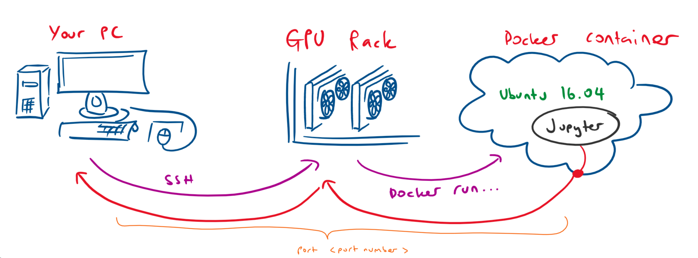

# Running Code
## Basics

Once you've connected to the remote server using SSH, you can start running code. You have a a few options here. You can;
- Write code on your local machine and run these scripts on the GPU rack
- Write code on the rack

Importantly though, you'll generally want to run your code in a way that doesn't interefere with others using the same rack. For this reason, you're going to want to run your code inside a docker container (or something similar).

## Docker Containers
### What is Docker?
Docker is a system that allows you to have seperate virtual-machine-like environments running on a computer at the same time. The point is for you to be able to run whatever OS, python version and/or packages you like without interfering with anyone else on the same computer. 

#### High Level Explanation
At a high level, there are "images" which specifify an OS version and packages. From a chosen image you'll create a "container" which is an actual running enviorment which you can enter into, install stuff, run code, and destroy.

#### How Do I Get Images
You can make them yourself (with a dockerfile), or you can download premade ones.

#### How Do I Make A Container
Just run a command based on 'docker run' and pass it some arguments. We'll go through this in more detail in the section that actually tells you what code to run.

## Gus' Quick Start Guide
In this section, we'll present a way you can connect to a docker environment in a way that will allow you to write and run code inside. In order to simplify the writing and running code part, we'll use a broswer based IDE called 'jupyter' <TODO LINK TO JUPYTERGUIDE>.

### Setup
These steps will only need to be performed once. 
1) Create an account for yourself on the GPU rack
2) Create a folder inside the GPU rack to store your code. You'll give docker access to this folder. I just create a folder in my home directory called 'storage'
3) Make sure you have some docker image. Some people create their own, but I think it's simpler to download a premade one with most of the things you'll need. One place you can obtain premade docker images for deep learning is here (https://github.com/ufoym/deepo). Note that a deepo image with ubuntu 16.04, python 3.6, jupyter, and all the main deep learning libraries should already be on the rack (ufoym/deepo:all-py36-jupyter)
4) Choose a port number. You'll use this to link from jupyter inside of the docker container through the GPU rack to your local machine. You can potentially use differnt numbers for these steps, but I find it simpler to choose one (e.g. 8888) that works for all stages. You'll need to choose one that nobody else in the lab is using on that GPU rack though. You can check what ports are used by docker containers by running the command 'docker container ls' inside the GPU rack.
5) (Optional) Create a setup bash shell script that you'll run inside your conatiner. This is a good way to install thngs that aren't included in the image, or to run other commands automatically. You'll need to create it inside the storage folder on the GPU rack that you intend yto point the docker container to. 
### Steps
1) SSH into the GPU rack
2) Run the following command (inside the rack):

`nvidia-docker run --shm-size=128g -v \<storage location you want to use on rack\>:\<storage location inside the docker container\> --ulimit memlock=\<maximum memory (RAM) allocation\> -it -p \<port number\>:\<port number\> --ipc=host \<docker image, e.g. ufoym/deepo:all-py36-jupyter\> [Optional] bash \<your bash shell script\>`

E.g.:

`nvidia-docker run --shm-size=128g -v /home/gus/storage/:/storage --ulimit memlock=32 -it -p 8888:8888 --ipc=host ufoym/deepo:all-py36-jupyter bash ./storage/setup.sh`

3) Run Jupyter

`jupyter notebook --no-browser --ip=0.0.0.0 --port=\<port number\> --allow-root --NotebookApp.token= --notebook-dir=\<storage location inside the docker container\>`

E.g.:

`jupyter notebook --no-browser --ip=0.0.0.0 --port=8888 --allow-root --NotebookApp.token= --notebook-dir='/storage'`

Note: You can also just put this line inside of your setup script to make things even faster

4) Create an SSH link between your local machine and the GPU rack:

`ssh -L \<port number\>:0.0.0.0:\<port number\> \<GPU rack IP\>`

E.g.:

`ssh -L 8888:0.0.0.0:8888 130.194.248.70`

5) Finally, open a browser and go to http://localhost:\<port number\>/. You should have a jupyter instance linking to a kernel running inside the docker conatiner on the rack! 

### This Seems Comlicated!
Maybe so. You can simplify these steps using bash aliases and including the command to run jupyter in your setup script.

